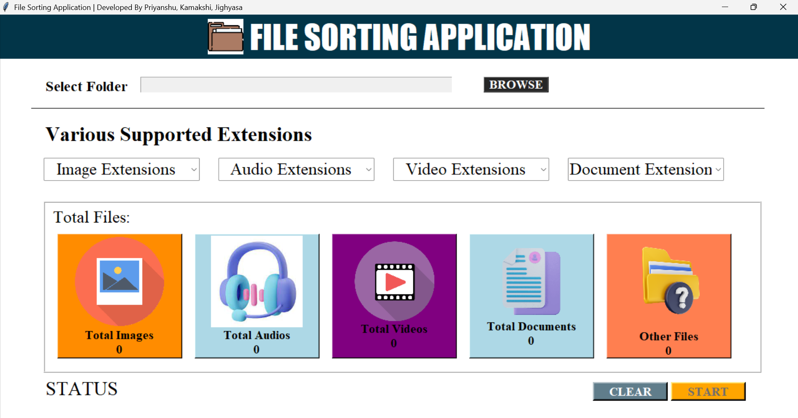

## File Sorting Application

A simple, user-friendly desktop tool to automatically organize files into folders by type (documents, images, audio, videos, and others). Built with Python. Ideal for cleaning up messy download folders or bulk-organizing project assets.

### Key Features
- **One-click sorting**: Moves files into categorized folders by extension.
- **Smart categories**: Documents, Images, Videos, Audio, and Others.
- **Safe operations**: Skips already-sorted files and preserves originals when moving between folders.
- **Visual GUI**: Clean interface for selecting source/destination and running the sorter.

### GUI Preview
<p align="center">
  
  <br/>
  <em>Application GUI – select a folder and sort your files in one click.</em>
  
</p>

### How It Works
1. Choose the folder you want to organize.
2. The app scans files and groups them by extension.
3. Files are moved into category subfolders:
   - `documents/` (e.g., pdf, docx, txt, csv)
   - `images/` (e.g., jpg, jpeg, png, gif, webp, avif)
   - `videos/` (e.g., mp4, avi, 3gp, mkv)
   - `audio/` (e.g., mp3, aac, wav, m4a)
   - `others/` (anything uncategorized)

### Getting Started
#### Prerequisites
- Python 3.8+
- Windows PowerShell or Command Prompt

#### Run the App
```bash
python FSA.py
```

If double-clicking `FSA.py` does not launch the GUI, run it from a terminal in the project directory.

### Example Project Structure
```text
File Sorting Application/
├─ FSA.py
├─ Images/
│  ├─ AppGUI.png
│  ├─ logo.png ...
├─ TEST FOLDER for PROJECT/
│  ├─ audio/
│  ├─ documents/
│  ├─ images/
│  └─ videos/
└─ README.md
```

### Supported Categories (with Icons)

| Category | Icon | Typical Extensions |
|---|---|---|
| Documents |  | pdf, docx, txt, csv, xls, pptx |
| Images |  | jpg, jpeg, png, gif, webp, avif |
| Videos |  | mp4, avi, mkv, mov, 3gp |
| Audio |  | mp3, aac, wav, m4a, flac |
| Others |  | everything else |

### Tips
- Run on a copy of your files if you want to preview the result safely.
- Keep the app open until the operation completes for all files.
- You can re-run the app multiple times; already sorted files are typically skipped.

### Troubleshooting
- If image previews in this README don’t render on Git platforms, ensure the `Images/` folder and filenames match exactly (case-sensitive in some environments). The GUI screenshot is expected at `Images/AppGUI.png`.
- If Python is not recognized, install it from `https://python.org` and add it to PATH during setup.

### License
This project is provided as-is for personal and educational use. Add a license if you plan to distribute.

### Credits
Application icons located in `Images/` are used for category visualization within the project.
